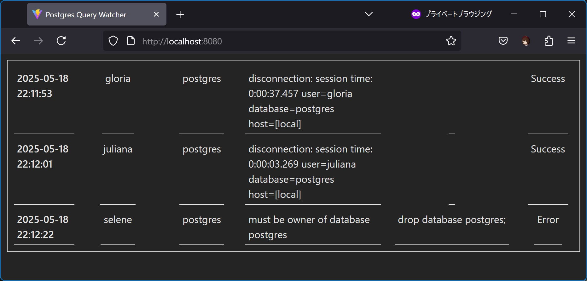

# pg-watch

PostgreSQLのクエリ実行状況をユーザーごとに確認できるツールです。
PostgreSQLを用いた演習やハンズオンの際に、参加者が手を動かしているか、
ハマっていないかをWebインタフェースで確認しながら進めることができます。



# つかいかた
docker composeで実行します。
PostgreSQLサーバーもcomposeで同時に初期化・実行されます。
DB初期化時に設定される管理者IDとパスワードは、`.env`ファイルに記述します。

```
$ cp configs/.env.example configs/.env
$ docker compose build
$ docker compose up -d
```

起動したら[http://localhost:8000/](http://localhost:8000/)にアクセスしてみてください。
